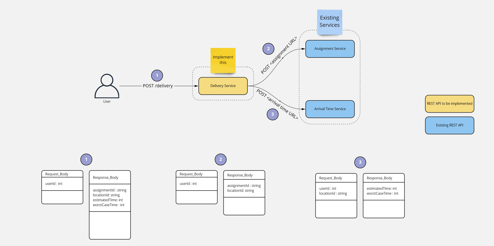

# Delivery Service

Create an endpoint for a crowd-sourced delivery application which takes a POST request at the `/delivery` route with a JSON body with the following structure:

```json
{ "userId" : "int" }
```

The request will respond with the following JSON:

```json
{ 
    "assignmentId" : "string",
    "locationId" : "string",
    "estimatedTime" : "int",
    "worstCaseTime" : "int"
}
```

* `assignmentId` is a GUID id representing the order assigned to the delivery person
* `locationId` is a GUID representing the location where the delivery should be made to
* `estimatedTime` is the likely amount of time in which the delivery should arrive (in minutes)
* `worstCaseTime` is the likely worst case amount of time in which the delivery should arrive (in minutes)

In order to get this information, the delivery service should query two other microservices: the `Assignment` and `Arrival Time` services. The data from the responses should be combined to create the above response. Note that the URLs for the below services should be configurable.


 ## Assignment Service

A service which takes a userId as input, then generates a a delivery assignment for that user.

* url: <assignment URL>
* method: POST
* request body format (JSON):

```json
{
   "userId" : "int"
}
```

* response body format (JSON):

```json
{
   "assignmentId" : "string",
   "locationId" : "string"
}
```

## Arrival Time Service

A service which takes a userId and destination locationId as input, then generates an arrival time estimate for the user to arrive at that location.

* url : <arrival time URL>
* method: POST
* request body format:

```json
{
   "userId" : "int",
   "locationId" : "string"
}
```

* response body format (JSON):

```json
{
    "estimatedTime" : "int",
    "worstCaseTime" : "int"
}
```


